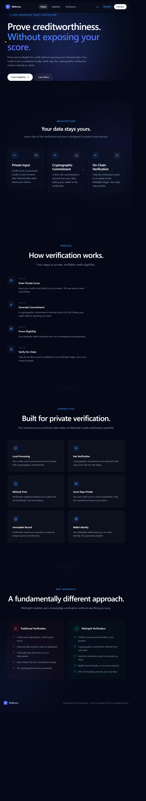
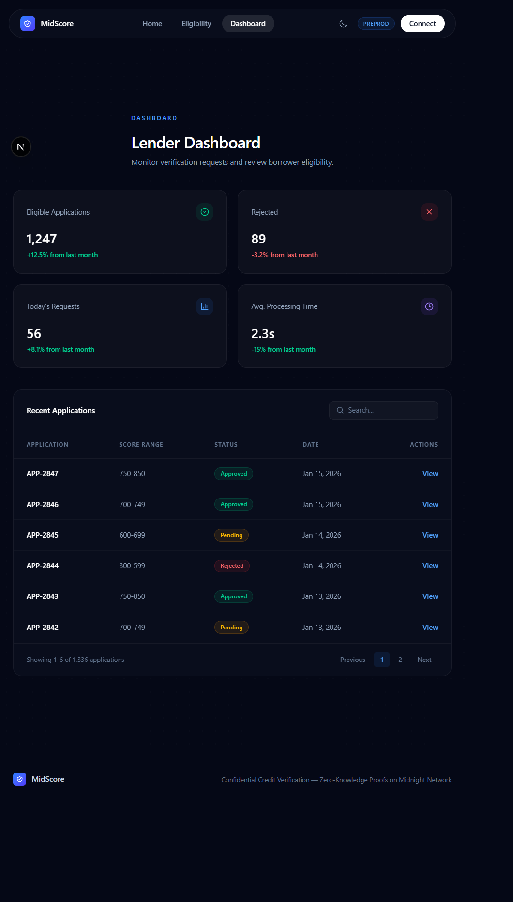
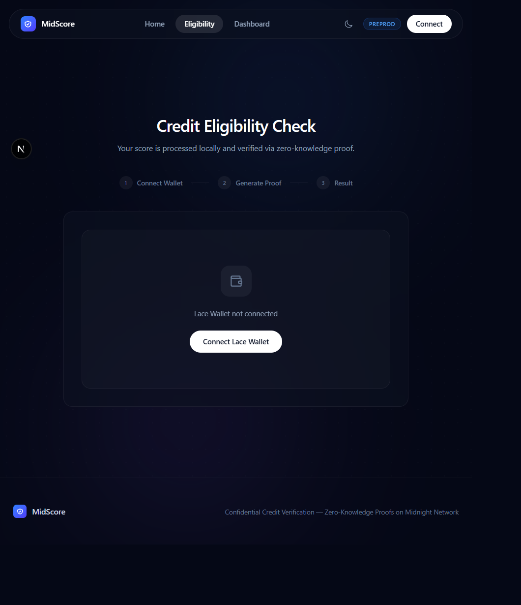

# MidScore — Confidential Credit Verification

Privacy-preserving credit eligibility verification using zero-knowledge proofs on the **Midnight Network**.

MidScore lets a borrower prove they meet a lender's credit eligibility bar — without ever revealing their actual credit score. The score is processed locally in the browser, a cryptographic commitment is derived from it, and a zero-knowledge proof of eligibility is generated and verified on-chain. Only the pass/fail result is ever public.

---

## 🚀 Live Demo & Deployment

- 🔗 **Live Web Application**: https://confidential-credit-verification-iass87fl1-acdc8.vercel.app
- 📜 **Deployed Compact Contract Address**:
  `60b892512f11275c9f5260a0983197d90fb2c476d425795c0371ee9d36e9870d`
- 🌐 **Network**: Midnight Preprod
- 🔍 **Explorer**: https://explorer.preprod.midnight.network
- 🎥 **Live Video Demo**: [Watch on YouTube](https://youtu.be/jtymsHlcXFc)

---

## 🖼️ Screenshots & UI Showcase

### 1. Landing Page & Overview
Home page walking through the privacy architecture (Private Input → Cryptographic Commitment → On-Chain Verification), the 4-step verification process, and a side-by-side comparison against traditional credit verification.



### 2. Eligibility Check & ZK Proof Flow
Connect a Midnight Lace wallet, then generate a zero-knowledge proof of eligibility in three steps: Connect Wallet → Generate Proof → Result.



### 3. Lender Dashboard
Real-time view of eligible applications, rejections, daily request volume, and average processing time, with a searchable, paginated table of recent applications.



---

## 💡 Product Proposal & Category

- **Category**: Privacy
- **Problem**: Borrowers today have to hand over their raw credit score and financial data to any lender or platform that wants to check eligibility — creating unnecessary exposure, centralized data-breach risk, and no guarantee the data isn't reused or resold.
- **Solution**: MidScore uses Midnight's Compact zero-knowledge contracts to let a borrower prove eligibility (e.g. "my score is above threshold X") without transmitting the score itself. Lenders get a cryptographically verifiable, on-chain eligibility result — with zero visibility into the underlying financial data.

---

## 🔐 Privacy Model & On-Chain vs. Private State

### 1. What Observers CAN Learn (Public Ledger State)
- **Verification result**: A boolean eligibility outcome (approved / not approved) per submission.
- **Wallet identity**: The wallet address that submitted the proof.
- **Timestamp**: When the verification was recorded on-chain.
- **Aggregate dashboard stats**: Counts such as total eligible applications, rejections, and daily request volume — derived only from public boolean results, never from raw scores.

### 2. What Observers CANNOT Learn (Private Witness & Network State)
- **The actual credit score**: The raw score is processed entirely client-side and never transmitted, logged, or included in any transaction.
- **Score composition or history**: No underlying financial detail (income, credit history, individual factors) is ever submitted.
- **Anything beyond the single boolean result**: The zero-knowledge proof only attests that the private witness satisfies the eligibility circuit — it reveals nothing else about the input.

### 3. Deliberate Disclosures
The only information intentionally published on-chain is:
- The **eligibility result** (pass/fail), associated with the wallet address that generated the proof.
- The **cryptographic commitment** (SHA-256) linking the wallet to the private score, used to prevent replay/reuse without exposing the score itself.

_TODO — if your Compact contract exposes named circuits (e.g. `verifyEligibility()`, `submitCommitment()`), list them here with a one-line description of what each discloses._

---

## 🛠️ System Requirements & Prerequisites

- Node.js 18+ and npm
- A Midnight-compatible wallet (**Lace**) browser extension, configured for **Preprod**
- Compact compiler 0.23 (only needed if you're modifying/recompiling the contract — not required to run the frontend)

---

## ⚡ Quick Start & Installation

### 1. Clone & Install Dependencies
```bash
git clone https://github.com/ChandranshuDutta025/confidential-credit-verification.git
cd confidential-credit-verification
cd frontend
npm install
```

### 2. Configure Environment
```bash
cp .env.example .env.local   # fill in preprod values
```

### 3. Run the App
```bash
npm run dev
```

Open http://localhost:3000 in your browser. Connect your Lace wallet (set to Preprod) to interact with the deployed contract:

`60b892512f11275c9f5260a0983197d90fb2c476d425795c0371ee9d36e9870d`

---

## 🧱 Tech Stack

| Layer | Technology |
|---|---|
| Smart Contracts | Compact 0.23 (Midnight Network ZK language) |
| Frontend | Next.js 15, React 19, TypeScript, Tailwind CSS v4 |
| Wallet | Midnight Lace wallet integration |
| Data Viz / Motion | Framer Motion, Recharts |

---

## ✨ Key Features

- Enter a credit score locally — raw data never leaves the browser
- Generate a cryptographic commitment (SHA-256) linking wallet to score
- Produce a zero-knowledge proof of eligibility without revealing the score
- Record only the boolean verification result on-chain
- View verification history in a searchable, filterable dashboard

---

## 🌐 Preview / Preprod Deployment Status

- ✅ Frontend deployed and live on Vercel
- ✅ Contract deployed to Midnight Preprod
- 🔄 _TODO — note any known faucet funding, node sync, or availability caveats here (e.g. "Preprod can be intermittently unavailable during network resets")_

---

## ✅ Submission Checklists

### Level 1 Checklist
- [x] Compact smart contract implemented with public/private state split
- [x] Deliberate disclosures (`disclose()`) used only for the necessary boolean/commitment output
- [x] Contract compiles and deploys to Midnight Preprod
- [ ] Unit tests covering circuit logic

### Level 2 Checklist
- [x] Lace wallet connect / disconnect flow
- [x] Contract read/write integration from frontend
- [x] Real-time dashboard reflecting on-chain verification state
- [ ] End-to-end tests covering the full proof-generation flow

### Level 3 Checklist
- [x] Deployment guide covering Preprod setup and reset handling
- [x] Public GitHub repo with clean commit history
- [x] Complete README (this document)
- [x] Demo video walkthrough

---

## 📄 License

_License: to be added._
